<h1 align="center">realping</h1>

<p align="center">
  Measure your site the way your users see it, not the way your laptop does.
</p>

<p align="center">
  
  = 18" src="https://img.shields.io/badge/node-%3E%3D18-brightgreen">
  
  
</p>

<p align="center">
  
</p>

## Your laptop is the worst place to measure from

Run `curl -w` against your own site and you learn about your own machine:

- **Your CDN edge.** You hit the node nearest you. Your users hit a different one.
- **Your DNS.** Warm in your resolver's cache, cold in theirs.
- **Your proxy or VPN.** If you use one, every timing you record is the proxy's,
  not yours. This is the failure that keeps people optimizing the wrong thing:
  the numbers look plausible, so nobody checks.
- **Your route.** Peering between your ISP and your host says nothing about
  peering between theirs and your host.

`realping` runs the request from real probes in other countries instead, using
the [Globalping](https://globalping.io) network. No API key, no account.

## Install

```bash
npm install -g github:ssepehrnoush/realping
```

Then:

```bash
realping example.com
```

Node 18 or newer. No dependencies, no API key, no account.

## Use

```bash
# the default spread of eight countries
realping example.com

# just the ones you care about, two probes each
realping example.com --from ir,tr,de --limit 2

# a specific page, sorted by total time
realping example.com --path /pricing --sort total

# save a baseline, compare after a change
realping example.com --json > before.json
```

```
CC  CITY         NETWORK                DNS  TCP  TLS  TTFB  TOTAL
IN  Mumbai       Oracle                   6    2    8     7     24
TR  Istanbul     HUAWEI CLOUDS            7    3   12    26     49
US  Buffalo      HostPapa                63   13   29    36    142
IR  Tehran       AbrArvan CDN and IaaS    5   79   89    94    268
DE  Falkenstein  Hetzner Online         The measurement timed out.

4/5 probes answered  |  median TTFB 31ms  |  median total 96ms  |  1 failed
```

## Iran is in the default list

Most latency tools measure from Frankfurt, Virginia and Singapore, which is
fine if that is where your users are. If any of them are behind heavy filtering
or a long, badly peered route, those numbers are not just optimistic, they are
about a different network.

`IR` ships in the default spread for that reason, alongside `TR DE NL GB US AE
IN`. If no probe is available in a country you asked for, the tool says so
rather than silently returning a shorter table.

## Reading the output

| Column | What it is |
| --- | --- |
| `DNS` | resolving the name, from that probe's resolver |
| `TCP` | the handshake, which is mostly raw round-trip time |
| `TLS` | negotiating the certificate, roughly two more round trips |
| `TTFB` | time to first byte: the honest number for how slow the page feels |
| `TOTAL` | everything, including transferring the body |

Timings are colour graded: under 300ms green, under a second yellow, past that
red. The summary reports the **median**, not the best result, because the
fastest probe is usually the one nearest your CDN edge, which is the number
that misled you in the first place.

## Failures are shown, not hidden

A probe can fail for ordinary reasons: a blocked port, a probe going offline
mid-measurement, a genuine timeout. Those rows stay in the table with the
reason, and count against the answered total. A tool that quietly drops them
reports a better median than reality.

## API

```js
import { measure, toRows, median } from "realping";

const payload = await measure({
  target: "example.com",
  countries: ["ir", "de", "us"],
  limit: 1,
});

const rows = toRows(payload);
console.log(median(rows.map((r) => r.ttfb)));
```

`measure` accepts injected `fetch` and `sleep`, which is how the test suite
runs without touching the network.

## Limits

- Globalping rate limits anonymous use. A handful of runs an hour is fine; a
  monitoring loop is not what this is for.
- Probes are volunteer-run. Coverage varies by country and by day, and a probe
  is a machine in a datacenter, not a phone on mobile data.
- This measures the network. It does not measure rendering, so it is a
  complement to Lighthouse, not a replacement.

## License

MIT
